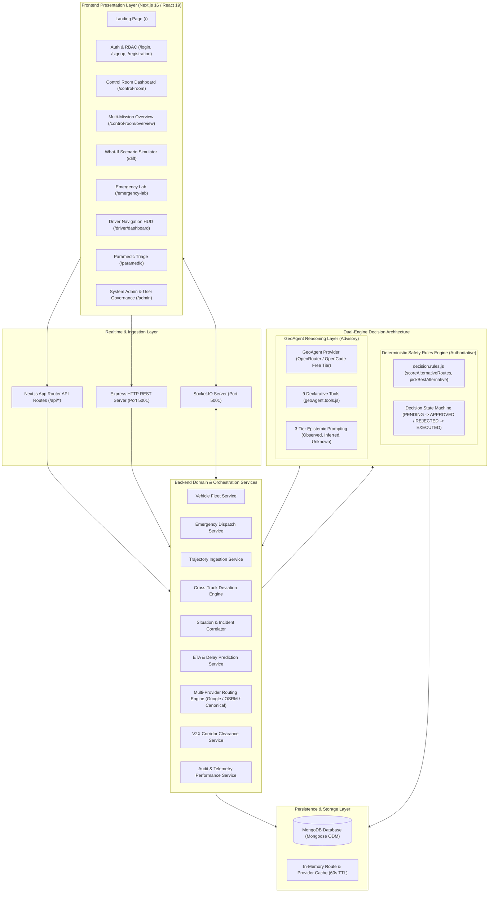
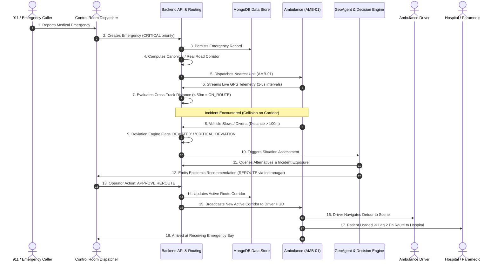
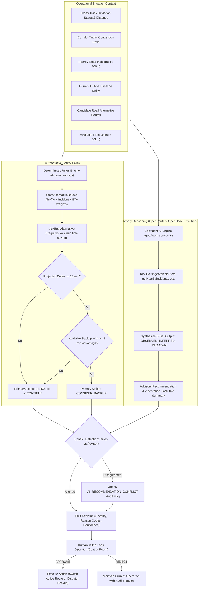
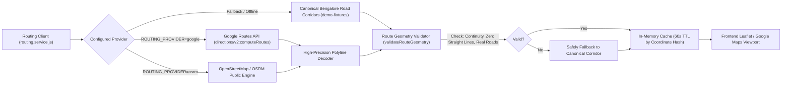
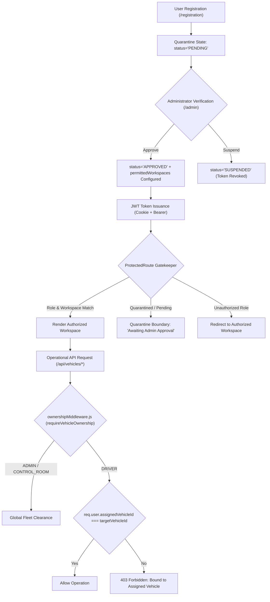
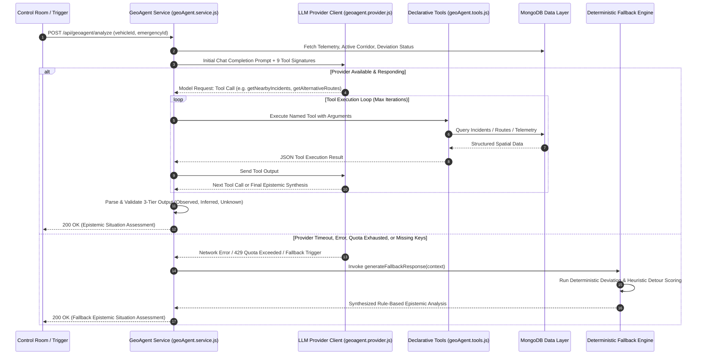
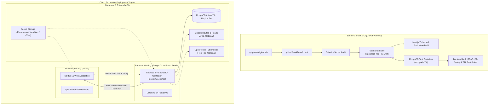
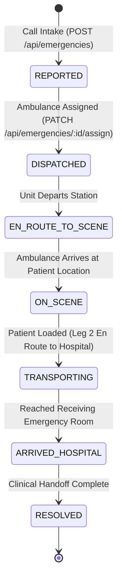
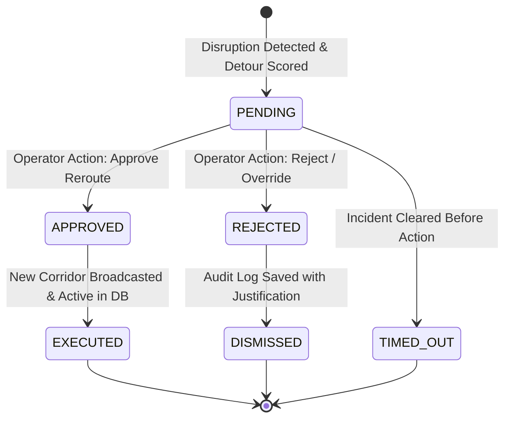

# SwiftCare GeoAgent — System Architecture & Data Flow Reference

This document provides the authoritative, complete technical architecture and data flow specifications for the **SwiftCare GeoAgent** Emergency Response Platform.

---

## 1. High-Level System Architecture

SwiftCare GeoAgent is built as a hybrid edge-and-cloud emergency operations platform comprising a Next.js 16 frontend, an Express 4 REST & WebSocket backend, a MongoDB persistent database, a deterministic decision engine, and GeoAgent free-tier LLM provider abstraction (OpenRouter / OpenCode) for operational epistemic reasoning.



---

## 2. Emergency Response Lifecycle

The standard operational lifecycle follows a strict state transition model from initial emergency call to patient delivery:



---

## 3. Realtime Telemetry & Deviation Ingestion Flow

The vehicle telemetry pipeline processes raw GPS fixes, cleans jitter via snapping, evaluates cross-track distance against the planned route line string, and broadcasts updates via Socket.IO:

```mermaid
flowchart TD
    A["Ambulance GPS Unit / Simulator"] -->|HTTP POST /api/trajectories or Socket.IO| B["Telemetry Ingestion Controller"]
    B --> C{"Coordinate Validation"}
    C -->|Invalid Lat/Lng| D["Reject 400 Bad Request"]
    C -->|Valid [lng, lat]| E["Check Google Roads Snap-to-Roads (if enabled)"]
    E --> F["Compute Haversine Step & Rolling Speed"]
    F --> G["Calculate Cross-Track Distance (distanceFromRouteMeters)"]
    G --> H{"Cross-Track Threshold"}
    
    H -->|< 50m| I["Status: ON_ROUTE"]
    H -->|50m - 100m| J["Status: WARNING"]
    H -->|100m - 200m| K["Status: DEVIATED"]
    H -->|> 200m| L["Status: CRITICAL_DEVIATION"]
    
    I --> M["Persist Trajectory Point to MongoDB"]
    J --> M
    K --> M
    L --> M
    
    M --> N["Broadcast via Socket.IO room: control-room"]
    M --> O["Broadcast via Socket.IO vehicle:{id}"]
    
    K --> P["Trigger Automatic Situation Analysis"]
    L --> P
```

---

## 4. Dual-Engine Decision Architecture: Deterministic Safety vs. Generative GeoAgent

SwiftCare enforces a strict architectural boundary between **Authoritative Deterministic Safety Rules** and **Advisory Generative Intelligence**:



---

## 5. Map & Multi-Provider Routing Architecture

The routing infrastructure abstracts multiple providers behind a unified interface:



---

## 6. Realtime Communication & Socket Room Topography

```mermaid
graph TD
    Client["Connected Browser Client"] --> Auth{"Handshake Auth (JWT Cookie/Bearer)"}
    Auth -->|Valid| Connect["Connection Established"]
    Auth -->|Invalid| Reject["Connection Rejected"]

    Connect --> JoinRoom{"Join Room Command"}
    JoinRoom -->|room:join 'control-room'| CRRoom["Room: control-room (Dispatches, Alerts, Global Telemetry)"]
    JoinRoom -->|room:join 'vehicle:{id}'| VRoom["Room: vehicle:{id} (Dedicated Driver Telemetry)"]
    JoinRoom -->|room:join 'emergency:{id}'| ERoom["Room: emergency:{id} (Mission Detail & Triage)"]
    JoinRoom -->|room:join 'clearance'| ClrRoom["Room: clearance (V2X Green-Wave Corridor Signals)"]

    BackendEmitters["Backend Event Emitters"] --> Emit{"Event Emission"}
    Emit -->|telemetry:update| CRRoom
    Emit -->|telemetry:update| VRoom
    Emit -->|emergency:update| ERoom
    Emit -->|decision:pending| CRRoom
    Emit -->|clearance:update| ClrRoom
```

---

## 7. Authentication, RBAC & Resource Ownership Architecture



---

## 8. GeoAgent Tool-Calling & Deterministic Fallback Sequence



---

## 9. Deployment Architecture & CI/CD Pipeline



---

## 10. Finite State Machines (Emergency & Decision Lifecycles)

### Emergency Incident State Transitions



### Deterministic Decision Lifecycle


