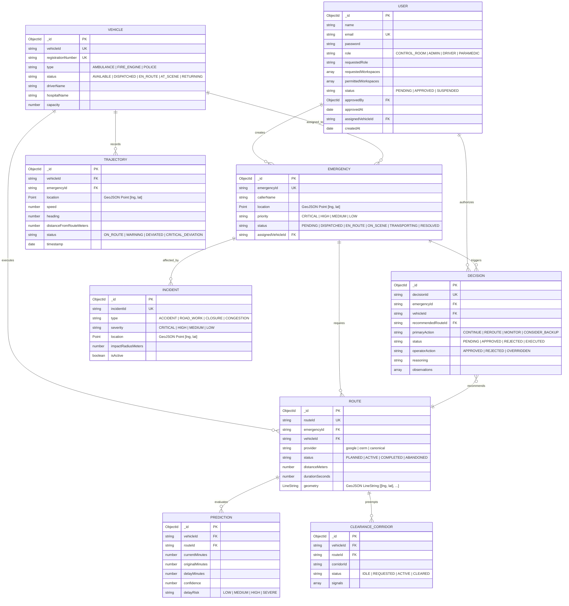

# SwiftCare GeoAgent — Database Architecture & Entity Schema Reference

This document provides the authoritative source-of-truth reference for all database models, collections, indexes, and relationships in the **SwiftCare GeoAgent** MongoDB persistent store.

---

## 1. Entity Relationship Diagram (ERD)

---

## 2. Collection Schemas & Verification

All schemas below are verified against active code in `server/modules/*/*.model.js`.

### 2.1 `users` Collection
- **Source**: `server/modules/auth/user.model.js`
- **Fields**:
  - `name`: String (Required, trimmed)
  - `email`: String (Required, unique, lowercase, trimmed)
  - `password`: String (Required, bcrypt hash with 12 salt rounds)
  - `role`: Enum `['CONTROL_ROOM', 'ADMIN', 'DRIVER', 'PARAMEDIC']` (Default: `CONTROL_ROOM`)
  - `requestedRole`: Enum `['CONTROL_ROOM', 'DRIVER', 'PARAMEDIC', 'ADMIN']` (Default: `CONTROL_ROOM`)
  - `requestedWorkspaces`: Array of Strings (Default: `['CONTROL_ROOM']`)
  - `permittedWorkspaces`: Array of Enums `['ADMIN', 'CONTROL_ROOM', 'DRIVER', 'PARAMEDIC']` (Default: `[]` — empty array until administrator explicitly approves designated workspaces)
  - `status`: Enum `['PENDING', 'APPROVED', 'SUSPENDED']` (Default: `PENDING`)
  - `approvedBy`: ObjectId (References `users._id`, default `null`)
  - `approvedAt`: Date (Default `null`)
  - `assignedVehicleId`: String (Trimmed, nullable, binds DRIVER to a specific vehicle like `AMB-01`)
- **Indexes**:
  - `{ email: 1 }` (Unique)
  - `{ role: 1, createdAt: -1 }` (Role filtering)
  - `{ status: 1, role: 1 }` (Admin quarantine and approval queries)
  - `{ assignedVehicleId: 1 }` (Vehicle ownership resolution)

### 2.2 `vehicles` Collection
- **Source**: `server/modules/vehicles/vehicle.model.js`
- **Fields**:
  - `vehicleId`: String (Required, unique, immutable, e.g. `AMB-01`)
  - `registrationNumber`: String (Required, unique, uppercase)
  - `type`: Enum `['AMBULANCE', 'FIRE_ENGINE', 'POLICE']`
  - `status`: Enum `['AVAILABLE', 'DISPATCHED', 'EN_ROUTE', 'AT_SCENE', 'RETURNING', 'OFFLINE', 'MAINTENANCE']`
  - `driverName`: String (Required)
  - `hospitalName`: String
  - `hospitalCode`: String
  - `capacity`: Number (Min: 1)
  - `isDeleted`: Boolean (Soft delete, default `false`)
- **Indexes**:
  - `{ vehicleId: 1 }` (Unique)
  - `{ status: 1, isDeleted: 1 }` (Dispatch querying)

### 2.3 `emergencies` Collection
- **Source**: `server/modules/emergencies/emergency.model.js`
- **Fields**:
  - `emergencyId`: String (Required, unique, e.g. `EMG-0001`)
  - `callerName`: String
  - `callerContact`: String
  - `location`: GeoJSON Point `{ type: 'Point', coordinates: [lng, lat], address: String }`
  - `priority`: Enum `['CRITICAL', 'HIGH', 'MEDIUM', 'LOW']`
  - `type`: Enum `['MEDICAL', 'TRAUMA', 'CARDIAC', 'FIRE', 'ACCIDENT', 'OTHER']`
  - `status`: Enum `['PENDING', 'DISPATCHED', 'EN_ROUTE', 'ON_SCENE', 'TRANSPORTING', 'RESOLVED', 'CANCELLED']`
  - `assignedVehicleId`: String (References `vehicles.vehicleId`)
- **Indexes**:
  - `{ emergencyId: 1 }` (Unique)
  - `{ location: '2dsphere' }` (Geospatial proximity search)
  - `{ status: 1, priority: 1 }` (Control room triage queue)

### 2.4 `routes` Collection
- **Source**: `server/modules/routes/route.model.js`
- **Fields**:
  - `routeId`: String (Required, unique)
  - `emergencyId`: String (References `emergencies.emergencyId`)
  - `vehicleId`: String (References `vehicles.vehicleId`)
  - `provider`: Enum `['google', 'osrm', 'canonical']`
  - `status`: Enum `['PLANNED', 'ACTIVE', 'COMPLETED', 'ABANDONED']`
  - `distanceMeters`: Number
  - `durationSeconds`: Number
  - `geometry`: GeoJSON LineString `{ type: 'LineString', coordinates: [[lng, lat], ...] }`
  - `waypoints`: Array of Points
- **Indexes**:
  - `{ routeId: 1 }` (Unique)
  - `{ emergencyId: 1, status: 1 }`
  - `{ geometry: '2dsphere' }`

### 2.5 `trajectories` Collection
- **Source**: `server/modules/trajectories/trajectory.model.js`
- **Fields**:
  - `vehicleId`: String (Required)
  - `emergencyId`: String
  - `location`: GeoJSON Point `{ type: 'Point', coordinates: [lng, lat] }`
  - `speed`: Number (km/h)
  - `heading`: Number (0-360 degrees)
  - `distanceFromRouteMeters`: Number (Cross-track offset)
  - `status`: Enum `['ON_ROUTE', 'WARNING', 'DEVIATED', 'CRITICAL_DEVIATION']`
  - `source`: Enum `['DEVICE', 'SIMULATOR', 'API', 'AUDIT']` (Default: `'SIMULATOR'`)
  - `timestamp`: Date (Default: `Date.now`)
- **Indexes**:
  - `{ vehicleId: 1, timestamp: -1 }` (Latest vehicle telemetry fix)
  - `{ emergencyId: 1, timestamp: -1 }` (Mission breadcrumb trail)
  - `{ location: '2dsphere' }`
  - `{ timestamp: 1 }` (Configurable TTL retention index with partialFilterExpression `{ source: { $in: ['SIMULATOR', 'DEVICE', 'API'] } }` to protect clinical audit records)

### 2.6 `incidents` Collection
- **Source**: `server/modules/incidents/incident.model.js`
- **Fields**:
  - `incidentId`: String (Required, unique)
  - `type`: Enum `['ACCIDENT', 'ROAD_WORK', 'CLOSURE', 'CONGESTION', 'HAZARD']`
  - `severity`: Enum `['CRITICAL', 'HIGH', 'MEDIUM', 'LOW']`
  - `location`: GeoJSON Point `{ type: 'Point', coordinates: [lng, lat] }`
  - `impactRadiusMeters`: Number (Default: 500)
  - `isActive`: Boolean (Default: `true`)
- **Indexes**:
  - `{ location: '2dsphere' }` (Corridor hazard intersection query)
  - `{ isActive: 1, severity: 1 }`

### 2.7 `decisions` Collection
- **Source**: `server/modules/decisions/decision.model.js`
- **Fields**:
  - `decisionId`: String (Required, unique)
  - `emergencyId`: String
  - `vehicleId`: String
  - `recommendedRouteId`: String
  - `primaryAction`: Enum `['CONTINUE', 'REROUTE', 'MONITOR', 'CONSIDER_BACKUP', 'ALERT_CONTROL_ROOM']`
  - `severity`: Enum `['INFO', 'WARNING', 'CRITICAL']`
  - `status`: Enum `['PENDING', 'APPROVED', 'REJECTED', 'EXECUTED', 'EXPIRED']`
  - `operatorAction`: Enum `['APPROVED', 'REJECTED', 'OVERRIDDEN']`
  - `operatorUserId`: ObjectId (References `users._id`)
  - `reasonCodes`: Array of Strings
  - `reasoning`: String (Advisory GeoAgent explanation)
  - `observations`: Object `{ observed: [], inferred: [], unknown: [] }`
- **Indexes**:
  - `{ decisionId: 1 }` (Unique)
  - `{ status: 1, createdAt: -1 }` (Pending decision queue)

### 2.8 `predictions` Collection
- **Source**: `server/modules/analysis/prediction.model.js`
- **Fields**:
  - `vehicleId`: String
  - `routeId`: String
  - `currentMinutes`: Number
  - `originalMinutes`: Number
  - `delayMinutes`: Number
  - `delayRisk`: Enum `['LOW', 'MEDIUM', 'HIGH', 'SEVERE']`
  - `confidence`: Number (0.0 to 1.0)
- **Indexes**:
  - `{ vehicleId: 1, createdAt: -1 }`

### 2.9 `clearancecorridors` Collection
- **Source**: `server/modules/clearance/clearance.model.js`
- **Fields**:
  - `corridorId`: String (Required, unique)
  - `vehicleId`: String
  - `routeId`: String
  - `status`: Enum `['IDLE', 'REQUESTED', 'ACTIVE', 'CLEARED']`
  - `signals`: Array of `{ signalId, intersectionName, state, preemptionActive }`
- **Indexes**:
  - `{ corridorId: 1 }` (Unique)
  - `{ vehicleId: 1, status: 1 }`

---

## 3. Database Safety Guard & Retention Architecture

### 3.1 Destructive Operation Protection (`server/shared/utils/dbSafety.js`)
To safeguard production emergency data from inadvertent wiping during development or testing, all seeding scripts (`seed-demo-scenario.js`, `seed-demo-scenarios.js`) and administrative reset services (`demo.service.js`) invoke `assertSafeDatabaseTarget(uri)` prior to running `deleteMany()`, `dropDatabase()`, or schema teardowns:
- **Atlas Protection**: Any URI starting with `mongodb+srv://` or pointing to a remote non-local host is blocked immediately.
- **Environment Exemption**: If execution on a remote database is deliberately intended, it requires explicit provision of `ALLOW_PRODUCTION_RESET=true`.
- **Naming Rule**: Allowed local databases must include `test` or `dev` in their connection URI when resetting.

### 3.2 Automated Telemetry Retention TTL
High-frequency vehicle breadcrumbs are pruned automatically via MongoDB's native TTL engine:
- Trajectory documents are indexed on `{ timestamp: 1 }` with `expireAfterSeconds: TELEMETRY_RETENTION_DAYS * 86400` (default 30 days).
- A MongoDB `partialFilterExpression: { source: { $in: ['SIMULATOR', 'DEVICE', 'API'] } }` ensures that clinical triage records and permanent legal audit trails (`source: 'AUDIT'`) are never pruned.
