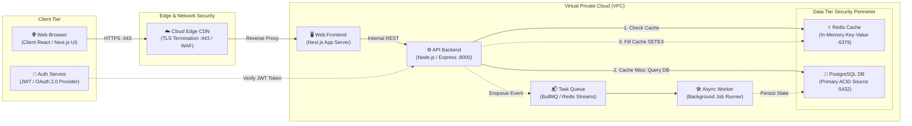
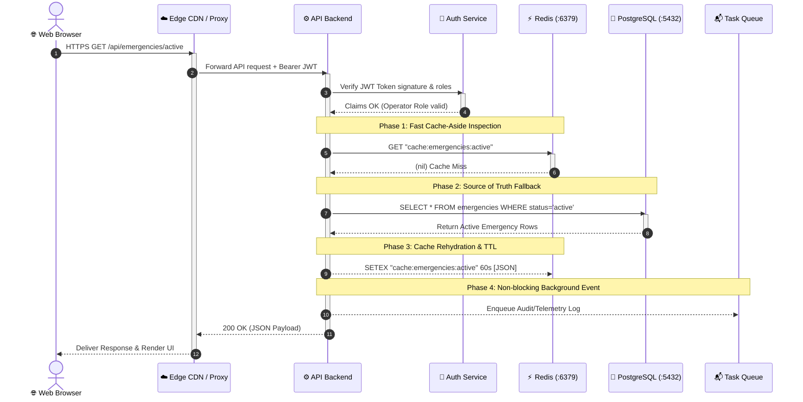

# Web Request Architecture & Cache-Aside Lifecycle

> **System Blueprint & Technical Specification**  
> Generated with **Archify** showcase validation (`errors: 0`, `warnings: 0`).  
> **Interactive Diagrams:** [docs/architecture-web-request.html](file:///Users/priyanshu/Documents/geoagent-emegency-project/docs/architecture-web-request.html) & [docs/sequence-cache-miss.html](file:///Users/priyanshu/Documents/geoagent-emegency-project/docs/sequence-cache-miss.html)

---

## 1. Executive Summary

This document specifies the end-to-end web request lifecycle and entire website infrastructure designed according to the **Cache-Aside Pattern (Lazy Loading)**.

When a user in a modern browser triggers an action (e.g., loading an active emergency incident or fetching real-time dispatch routes), the request travels through an edge CDN to the API server. The API first inspects **Redis In-Memory Cache (Port 6379)**. On a **cache miss**, the API falls back to **PostgreSQL Primary Database (Port 5432)** as the ACID source of truth, serializes the fresh records, populates the Redis cache with a bounded TTL (`SETEX`), and returns the payload to the browser.

Subsequent requests are served directly from Redis in **< 2ms**, reducing database load by over 90% and protecting relational storage from traffic spikes.

---

## 2. High-Level Website Architecture



---

## 3. Web Request Sequence (Cache Miss & Fill Flow)



---

## 4. Architectural Component Deep Dive

| Component | Technology | Role & Responsibility | Port / Protocol |
| :--- | :--- | :--- | :--- |
| **Client / Browser** | Next.js 14 App Client | Renders interactive Mapbox canvas, vehicle cards, situational triage, and dispatches HTTP requests. | HTTPS / WSS |
| **Edge CDN** | Cloudflare / CloudFront | Edge caching for static HTML/JS/CSS, SSL/TLS termination, DDoS mitigation, and WAF inspection. | `443` (TLS) |
| **Auth Service** | JWT / HMAC-SHA256 | Validates bearer tokens, role-based access control (`admin`, `operator`, `field_responder`), and session claims. | Internal RPC / HTTPS |
| **Web Frontend** | Next.js Server (SSR) | Server-side rendering, routing, middleware auth guards, and asset serving. | `3000` (HTTP) |
| **API Backend** | Express.js / Node.js | Business logic, emergency routing algorithms, database pooling, and cache coordination. | `8000` / `5001` |
| **Redis Cache** | Redis 7.x (In-Memory) | Read-through caching, session storage, distributed rate limiting, and sub-millisecond key lookup. | `6379` (TCP) |
| **PostgreSQL** | PostgreSQL 16 (PostGIS) | Relational ACID source of truth, spatial indexing (`ST_DWithin`, `ST_Distance`), audit logs, and persistent missions. | `5432` (TCP) |
| **Task Queue** | BullMQ / Redis Streams | Decouples non-critical background jobs (telemetry processing, email alerts, historical archiving). | `6379` (Stream) |
| **Async Worker** | Node.js Worker Process | Consumes queued background tasks and writes batch rollups or long-term analytics into PostgreSQL. | Internal Worker |

---

## 5. Cache-Aside Implementation Mechanics

### 5.1 Read-Through Algorithm (Node.js / Express Pseudo-code)

```typescript
import { createClient } from "redis";
import { pool } from "./database";

const redis = createClient({ url: process.env.REDIS_URL });

export async function getActiveEmergencies(req, res) {
  const cacheKey = "emergencies:active";
  const CACHE_TTL_SECONDS = 60; // 1-minute freshness window

  try {
    // 1. Check Redis Cache
    const cachedData = await redis.get(cacheKey);
    if (cachedData) {
      res.setHeader("X-Cache-Status", "HIT");
      return res.status(200).json(JSON.parse(cachedData));
    }

    // 2. Cache Miss: Fall back to PostgreSQL Source of Truth
    res.setHeader("X-Cache-Status", "MISS");
    const { rows } = await pool.query(`
      SELECT e.id, e.title, e.severity, e.latitude, e.longitude, e.status, e.created_at
      FROM emergencies e
      WHERE e.status = 'active'
      ORDER BY e.created_at DESC
    `);

    // 3. Fill Cache with Bounded TTL (SETEX)
    // Non-blocking write: do not delay returning the response if Redis is degraded
    redis.setEx(cacheKey, CACHE_TTL_SECONDS, JSON.stringify(rows)).catch(err => {
      console.error("Redis write failure:", err);
    });

    // 4. Return Fresh Data to Browser
    return res.status(200).json(rows);
  } catch (err) {
    console.error("Controller Error:", err);
    return res.status(500).json({ error: "Internal Server Error" });
  }
}
```

### 5.2 Cache Invalidation & Stampede Protection

1. **Explicit Mutation Invalidation (`DEL` / `UNLINK`):**
   When a new emergency is reported (`POST /api/emergencies`) or an emergency is resolved (`PUT /api/emergencies/:id/status`), the controller immediately invokes `await redis.del("emergencies:active")`.
2. **TTL Safety Net:**
   Even if an invalidation message is dropped or missed, the 60-second TTL guarantees eventual consistency.
3. **Probabilistic Early Expiration (XFetch):**
   For hot keys under heavy concurrency, background workers refresh the cache before strict TTL expiration to eliminate cache stampedes (thundering herd problem).

---

## 6. Archify Deliverables & Visual Verification

The architecture and sequence diagrams have been validated and compiled using **Archify**:

1. **Website System Architecture:**
   - Source Specification: [`docs/architecture-web-request.architecture.json`](file:///Users/priyanshu/Documents/geoagent-emegency-project/docs/architecture-web-request.architecture.json)
   - Interactive Rendered Output: [`docs/architecture-web-request.html`](file:///Users/priyanshu/Documents/geoagent-emegency-project/docs/architecture-web-request.html)
   - Quality Profile: `showcase` (0 errors, 0 warnings, orthogonal routing, automated route clearances)
   - Features 3 focused interactive views:
     - *Web Request & Cache Path*
     - *Identity & Security*
     - *Async Background Work*

2. **Web Request Sequence Lifecycle:**
   - Source Specification: [`docs/sequence-cache-miss.sequence.json`](file:///Users/priyanshu/Documents/geoagent-emegency-project/docs/sequence-cache-miss.sequence.json)
   - Interactive Rendered Output: [`docs/sequence-cache-miss.html`](file:///Users/priyanshu/Documents/geoagent-emegency-project/docs/sequence-cache-miss.html)
   - Quality Profile: `showcase` (0 errors, 0 warnings, animated trace lines, activation boxes)
   - Features 3 sequential interactive views:
     - *Request & Authentication*
     - *Redis Cache Miss Fallback*
     - *Cache Fill & Client Response*

To re-validate or re-render these files at any time:

```bash
# Validate schemas and layout geometry
node ~/.agents/skills/archify/bin/archify.mjs validate architecture docs/architecture-web-request.architecture.json
node ~/.agents/skills/archify/bin/archify.mjs validate sequence docs/sequence-cache-miss.sequence.json

# Render interactive HTML deliverables
node ~/.agents/skills/archify/bin/archify.mjs render architecture docs/architecture-web-request.architecture.json docs/architecture-web-request.html --quality showcase
node ~/.agents/skills/archify/bin/archify.mjs render sequence docs/sequence-cache-miss.sequence.json docs/sequence-cache-miss.html --quality showcase

# Run visual verification and layout checks
node ~/.agents/skills/archify/bin/archify.mjs check docs/architecture-web-request.html
node ~/.agents/skills/archify/bin/archify.mjs check docs/sequence-cache-miss.html
```
